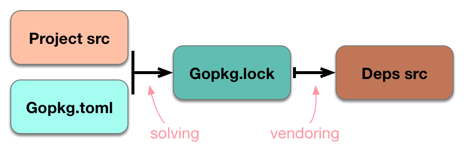
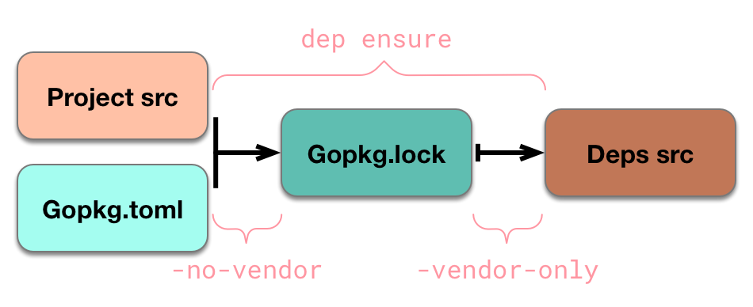
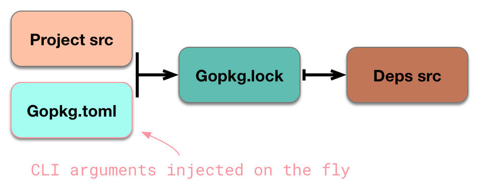
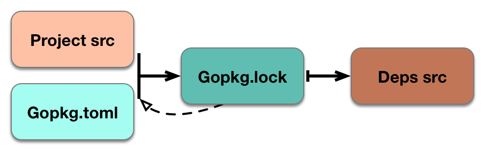

Dep具有许多分离的元件和运动部件,所有这些部件围绕中心模型旋转.该文件解释了模型,然后在该模型的背景下探讨Dep的主要机制.

## 状态与流程

Dep的核心思想是"四状态系统"——对磁盘与包管理器交流的状态进行分类和组织的模型. 这个连贯的、通用的模型，首次表述在[这篇(长)文章](https://medium.com/@sdboyer/so-you-want-to-write-a-package-manager-4ae9c17d9527)。 虽然四种状态模型中的许多原理是，从现有的包管理器中派生出来的.

简言之,这四种状态是:

1.  [当前项目](glossary.zh.md#current-project)的源代码.
2.  一个[主内容-manifest](glossary.zh.md#manifest)-描述当前项目的依赖要求的文件.在Dep中,就是[`Gopkg.toml`](Gopkg.toml.zh.md)文件.
3.  一个[锁-lock](glossary.zh.md#lock)-一个包含传递完整的、可再现的依赖图的描述文件.在Dep中,就是[`Gopkg.lock`](Gopkg.lock.zh.md)文件.
4.  源代码本身的依赖性.在Dep的当前设计中,就是`vendor/`目录.

我们可以直观地表示这四个状态如下:


### 功能流程

把Dep认为是一种系统，有助于你理解,它在这些状态关系之间施加单向的、功能性的流动过程.这些函数将上述状态作为输入和输出, 若将它们从左向右移动.总体,有两个功能:

-   一个是*求解-solving 函数*，将当前项目中的导入集合和规则，作为`Gopkg.toml`的输入, 并返回一个传递完整的、不可变的依赖图的输出——`Gopkg.lock`中的信息.
-   一个是*vendoring 函数*，将`Gopkg.lock`中获取的信息作为其输入,并确保源文件的磁盘安排,例如编译器应使用**lock**中的指定版本.

我们可以直观地表示这两个函数:



这是`dep ensure`-典型的流程,被使用在当`Gopkg.toml`存在时.当一个项目还没有`Gopkg.toml`,`dep init`可以生成一个. 必要的流程保持不变,但改变了输入:不是读取现有的`Gopkg.toml`文件, `dep init`构造，推理出的数据。数据来自用户的GOPATH,和/或者[来自另一个工具的元数据文件](<>). 换言之,`dep init`自动将项目从其他组织依赖的方法迁移到Dep方式.

此图也直接反映了代码. **求解函数**实际上被分解成一个构造和一个方法——我们首先新建一个[`Solver`](https://godoc.org/github.com/golang/dep/gps#Solver)类型,然后调用它的`Solve()`方法. 构造函数的输入是一个[`SolveParameters`](https://godoc.org/github.com/golang/dep/gps#SolveParameters)封装结构, 看起来应该很熟悉:

```go
type SolveParameters struct {
	RootPackageTree pkgtree.PackageTree // Parsed project src; contains lists of imports
	Manifest gps.RootManifest // Gopkg.toml
	...
}
```

**vendoring 函数**是[`gps.WriteDepTree()`](https://godoc.org/github.com/golang/dep/gps#WriteDepTree). 虽然需要少量的参数,但相关的参数也就[`gps.Lock`](https://godoc.org/github.com/golang/dep/gps#Lock)-表示在一个`Gopkg.lock`中保存数据的抽象接口.

四状态系统和这些功能流程是所有Dep行为建立的基础. 如果你想了解Dep的机制, 请把这个模型放在你的思维的最前沿.

### 保持同步

dep的设计目标之一, 是它的两个"功能",它们所做的工作,以及它们在各自的输出中引起的变化，都是最小/少的. 因此,这两个函数窥视在之前存在的输出结果, 以了解实际需要做什么工作:

-   **求解-Solving 函数**，检查现有的`Gopkg.lock`, 以确定其所有输入是否满足.如果是,则可以完全绕过求解函数. 如果不是,则求解函数继续进行,但会尝试`Gopkg.lock`尽可能变化很少的'路'.
-   **vendoring函数**，已经哈希处理了每个离散项目，放在`vendor/`. 并看看`Gopkg.lock`指示的和磁盘上的代码. 只有哈希错配的项目才被重写.

具体地说,Dep定义了一些必须满足的多个不变量:

| 同步 不变 | 处理 when 不同步 | 函数 |
| -------------- | ------------------------ | ---- |
|  `Gopkg.toml`所有的 [`required`](Gopkg.toml.zh.md#required) 声明必须存在于`Gopkg.lock`的[`input-imports`](Gopkg.lock.zh.md#input-imports)列表中 . | 对变化的项目，重新-求解, 更新 `Gopkg.lock` 和 `vendor/`  | Solving |
| 在当前项目的 非-[`ignored`]((Gopkg.toml.zh.md#ignored)), 非-隐藏 包的 所有 `import` 声明 必须存在于`Gopkg.lock`的[`input-imports`](Gopkg.lock.zh.md#input-imports)列表中. | 对变化的项目，重新-求解, 更新 `Gopkg.lock` 和 `vendor/` | Solving |
| [`Gopkg.lock`的 所有 versions](Gopkg.lock.zh.md#version-information-revision-version-and-branch) 必须接受和遵循 `Gopkg.toml` 的 `[[constraint]]` 或 `[[override]]` 声明模式 . | 对变化的项目，重新-求解, 更新 `Gopkg.lock` 和 `vendor/` | Solving |
| `Gopkg.lock`中 每个 `[[project]]` 的 [`pruneopts`](Gopkg.lock.zh.md#pruneopts)  必须等于  `Gopkg.toml`中的声明. | 更新 `Gopkg.lock` 和 `vendor/` | Vendoring\* |
| `Gopkg.lock`中 每个`[[project]]` 的  [`digest`](Gopkg.lock.zh.md#digest) 必须等于 来自`vendor/`当前哈希内容的值 | 重生成`vendor/`的这个项目, 和 若有需要，更新 `Gopkg.lock`中的新digest | Vendoring |

(\*)`pruneopts`有点奇怪,因为`Gopkg.toml`和`Gopkg.lock`之间不同步, 但这并不能触发**Solving**.

<!-- HERE -->

如果向前查看显示同步不变量已经满足,那么相应的函数不需要做任何工作;如果不满足,则dep采取解析步骤.无论哪种方式,什么时候`dep ensure`完成后,我们可以确信,我们处于"已知良好状态",所有的不变量保持不变.

`dep check`将计算所有上述关系,如果任何不变量不成立,它将打印对去同步和出口1的描述.此行为可以在每个项目基础上禁用,使用[`noverify`Gopkg.toml田野](Gopkg.toml.zh.md#noverify).

## `dep ensure`标志与行为变异

每一个`dep ensure`各种标志会影响解决和发布功能的行为,甚至影响它们是否运行.一些标志也会暂时导致项目不同步.在Dep的基本模型的背景下思考这些效应是理解正在发生的事情的最快路径.

### `-no-vendor`和`-vendor-only`

这两个标志是互斥的,并决定哪一个`dep ensure`这两个函数实际上是被执行的.经过`-no-vendor`只会导致求解函数的运行,导致创建一个新的`Gopkg.lock`;`-vendor-only`将跳过只解决版本管理功能,导致`vendor/`被重新填充`Gopkg.lock`.



经过`-no-vendor`有助于使解决功能无条件地运行,绕过通常进行的预检查.`Gopkg.lock`看看它是否已经满足所有输入.

### `-add`

通用的目的`dep ensure -add`是为了便于将新的依赖项引入到DepGRAM中.反之`-update`限于[源根](glossary.zh.md#source-root),例如`github.com/foo/bar`)`-add`可以以任何包导入路径作为参数(例如`github.com/foo/bar`或`github.com/foo/bar/baz`)

从概念上讲,有两种可能的东西`-add`可能是介绍.任何`dep ensure -add`运行将至少其中之一:

1.  运行求解函数以生成新的`Gopkg.lock`用新的依赖(IES)
2.  将版本约束附加到`Gopkg.toml`

这意味着两个前提条件.`dep ensure -add`其中至少有一个必须满足:

1.  命名导入路径当前不在项目的导入语句中,或者在`Gopkg.toml`的`required`列表
2.  没有`[[constraint]]`中节`Gopkg.toml`对于与命名导入路径相对应的项目根

还可以显式指定版本约束:

```bash
$ dep ensure -add github.com/foo/bar@v1.0.0
```

当参数中不包含版本约束时,求解函数将选择工作的最新版本(通常,最新的semver版本,如果没有semver版本,则选择默认的分支).如果求解成功,那么参数指定的版本,或者如果没有,那么由求解器选择的版本将被附加到`Gopkg.toml`.

由输入和当前项目状态的各种差异引起的行为变化最好用矩阵表示:

| Argument to `dep ensure -add` | Has `[[constraint]]` stanza in `Gopkg.toml` | In imports or `required` | Result |
| ----------------------------- | ------------------------------------------- | ------------------------ | ------ |
| `github.com/foo/bar` | N | N | Added temporarily to `Gopkg.lock` & `vendor/`; inferred version constraint appended to `Gopkg.toml` |
| `github.com/foo/bar@v1.0.0` | N | N | Added temporarily to `Gopkg.lock` & `vendor/`; specified version constraint appended to `Gopkg.toml` |
| `github.com/foo/bar` | Y | N | Added temporarily to `Gopkg.lock` & `vendor/` |
| `github.com/foo/bar@v1.0.0` | Y | - | **Immediate error**: constraint already present in `Gopkg.toml` |
| `github.com/foo/bar` | N | Y | Infer version constraint from `Gopkg.lock` and add to `Gopkg.toml` |
| `github.com/foo/bar` | Y | Y | **Immediate error:** nothing to do |

对于任何路径`dep ensure -add`需要运行求解函数以便生成更新`Gopkg.lock`将来自CLI参数的相关信息应用于内存的表示.`Gopkg.toml`:



需要添加的导入路径参数通过`required`列表,如果指定了明确版本要求,则等于`[[constraint]]`创建.

虽然这些规则最终会被坚持,如果解决成功,它们至少是短暂的,直到解决成功.从求解者的角度来看,短暂的规则与源于磁盘的规则是难以区分的.因此,对求解器,`dep ensure -add foo@v1.0.0`与修改相同`Gopkg.toml`通过添加`"foo"`到`required`列表,加上`[[constraint]]`节与`version = "v1.0.0"`然后运行`dep ensure`.

然而,因为这些修改是短暂的,是成功的.`dep ensure -add`可能实际上推动项目不同步.约束修改通常没有,但是如果`required`列表被修改,然后该项目将不同步.用户被警告:

```bash
$ dep ensure -add github.com/foo/bar
"github.com/foo/bar" is not imported by your project, and has been temporarily added to Gopkg.lock and vendor/.
If you run "dep ensure" again before actually importing it, it will disappear from Gopkg.lock and vendor/.
```

### `-update`

行为`dep ensure -update`与解决者自身的行为密切相关.关于这一点的完整细节是[求解参考材料](the-solver.zh.md),但为了理解的目的`-update`我们可以简化一点.

第一,巩固讨论中的含义.[功能优化](#staying-in-sync)求解函数实际上考虑了预先存在的问题.`Gopkg.lock`运行时:



注射`Gopkg.lock`进入解决者是必要的.如果我们希望解决方案默认保存先前选定的版本,那么求解器必须了解现有的.`Gopkg.lock`从某处.否则,它就不知道该保存什么了!

这样,锁是另一个编码到属性的属性.[先前讨论](<>) `SolveParameters`结构.这加上另外两个属性,是最显著的.`-update`:

```go
type SolveParameters struct {
	...
	Lock gps.Lock // Gopkg.lock
	ToChange []gps.ProjectRoot // args to -update
	ChangeAll bool // true if no -update args passed
	...
}
```

通常,当求解器遇到一个项目名称时,它有一个条目`Gopkg.lock`它把这个版本拉出来,放到这个项目的可能版本队列的头上.当特定的依赖性传递给`dep ensure -update`然而,它被添加到`ToChange`当解决方案遇到一个列出的项目时`ToChange`它只是跳过锁中的版本.

"跳过从锁中拉出版本"意味着`dep ensure -update github.com/foo/bar`等同于移除`[[project]]`诗节`github.com/foo/bar`从你`Gopkg.lock`然后运行`dep ensure`. 然而,确实不推荐使用这种方法,而且将来可能会引入一些细微的改变,使等效性复杂化.

如果`-update`没有参数传递,则`ChangeAll`设置为`true`导致解算器忽略`Gopkg.lock`对于所有新遇到的项目名称.这相当于将所有依赖项显式传递为参数.`dep ensure -update`以及`rm Gopkg.lock && dep ensure`. 然而,这两种方法都不被推荐,未来的变化可能带来微妙的差异.

当版本提示从`Gopkg.lock`不是放在版本队列的最前面,这意味着dep将探索特定依赖项的可能版本集.这种探索是按照A来进行的.[固定排序顺序](https://godoc.org/github.com/golang/dep/gps#SortForUpgrade),首先尝试更新版本,导致更新.

比如说有一个项目,`github.com/foo/bar`,以下版本:

```bash
v1.2.0, v1.1.1, v1.1.0, v1.0.0, master
```

如果我们依赖那个项目`^1.1.0`并拥有`v1.1.0`在我们`Gopkg.lock`这意味着有三个版本与我们的约束相匹配,其中两个版本比当前选择的版本要更新.(还有一个较旧的版本,`v1.0.0`和A`master`分支,但这些是不允许的`^1.1.0`约束)一个普通的`dep ensure`运行将复制和推`v1.1.0`排在队伍前面的其他人:

```bash
[v1.1.0, v1.2.0, v1.1.1, v1.1.0, v1.0.0, master]
```

和`v1.1.0`将再次被选中,除非出现一些其他条件迫使解算器丢弃它.跑步时`dep ensure -update github.com/foo/bar`然而,锁定的版本没有准备好:

```bash
[v1.2.0, v1.1.1, v1.1.0, v1.0.0, master]
```

所以,除了一些其他的冲突,`v1.2.0`被选择,导致期望的更新.

#### `-update`约束类型

继续我们的例子,重要的是要注意更新`-update`顺便说一下,解决者从来没有明确地针对更新的版本.它只是跳过从锁中添加一个提示,然后在队列中选择满足约束的第一个版本.因此,`-update`只对某些类型的约束有效.

它确实适用于分支约束,我们可以通过包括基础修订来观察.如果用户已受到限制`branch = "master"`和`Gopkg.lock`点在一个拓扑旧版本(例如,`aabbccd`)比规范源的顶端`master`分支(如:`bbccdde`)`dep ensure`最终将构建一个看起来像这样的队列:

```bash
[master@aabbccd, v1.1.0, v1.2.0, v1.1.1, v1.1.0, v1.0.0, master@bbccdde]
```

用`-update`头部的暗示将被省略;`branch = "master"`将导致求解器拒绝所有语义版本,并最终解决.`master@bbccdde`.

版本队列中的所有版本都跟踪底层修订,这意味着如果,例如,一些上游项目强制推送git标记,那么情况也是如此:

```bash
[v1.1.0@aabbccd, v1.1.0, v1.2.0, v1.1.1, v1.1.0@bbccdde, v1.0.0, master]
```

因此,即使上游标记在项目的一个依赖项中被强制推送,dep将保留原始修订,直到您显式地允许它通过`dep ensure -update`.

这里的关键是`-update`的行为受指定的约束类型的约束:

| `Gopkg.toml` version constraint type | Constraint example | `dep ensure -update` behavior |
| ------------------------------------ | ------------------ | ----------------------------- |
| `version` (semver range) | `"^1.0.0"` | Tries to get the latest version allowed by the range |
| `branch` | `"master"` | Tries to move to the current tip of the named branch |
| `version` (non-range semver) | `"=1.0.0"` | Change can only occur if the upstream release was moved (e.g. `git push --force <tag>`) |
| `version` (non-semver) | `"foo"` | Change can only occur if the upstream release was moved |
| `revision` | `aabbccd...` | No change is possible |
| (none) | (none) | The first version that works, according to [the sort order](https://godoc.org/github.com/golang/dep/gps#SortForUpgrade) |
